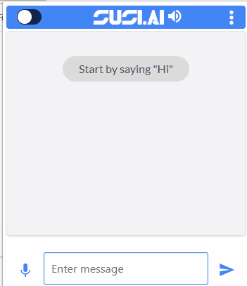

# Chrome extension to access SUSI.AI

[](https://www.codacy.com/app/zamhaq/susi_chromebot?utm_source=github.com&utm_medium=referral&utm_content=fossasia/susi_chromebot&utm_campaign=badger)
[](https://travis-ci.org/fossasia/susi_chromebot)
[](https://gitter.im/fossasia/susi_server)

This is a chrome extension to access SUSI.AI.

In certain situations the user wants to access certain functionalities of SUSI.AI without leaving the tab they are currently browsing. In those situations, using a chrome extension could turn out to be a viable option, and that is exactly what we're trying to accomplish.

## Installation

```sh
$ git clone https://github.com/fossasia/susi_chromebot
$ cd susi_chromebot
$ cd src
```

1. Clone this repository.
2. Goto `chrome://extensions` on your chrome browser.
3. Turn on developer mode if not already on.
4. Load unpacked extension from `src` folder.
5. Click on the SUSI icon you see on your browser toolbar. (Or) Use The keyboard shortut ``Alt+Shift+s``.
6. Click on the settings icon (top left of the popup) to allow mic access.

## Working GIF




# Want to Contribute?

Check Issues [here](https://github.com/fossasia/susi_chromebot/issues).

Read `CONTRIBUTING.md` [here](https://github.com/fossasia/susi_chromebot/blob/master/.github/CONTRIBUTING.md).

# Communication

Our chat channel on gitter can be found [here](https://gitter.im/fossasia/susi_server).
